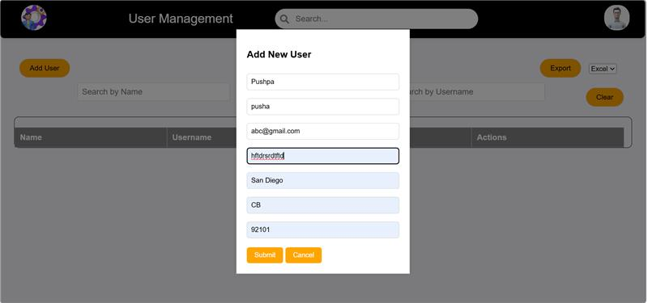
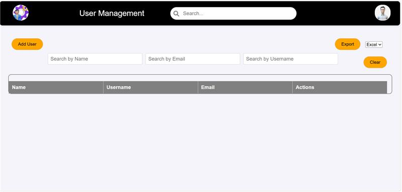
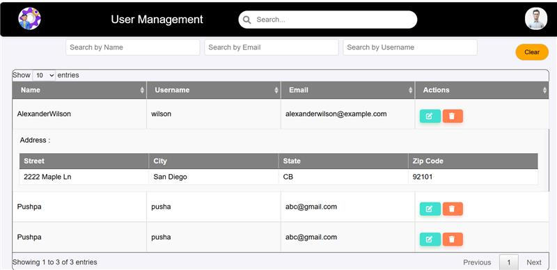

# **User Management System**

A comprehensive web application that allows users to manage profiles, add user data, upload profile pictures, and export data in various formats (CSV, PDF, Excel). The system is built using **HTML, CSS, JavaScript, and jQuery**, providing an interactive and responsive experience.

---

## **Table of Contents**
- [Introduction](#introduction)
- [Features](#features)
- [Installation Instructions](#installation-instructions)
- [Usage Instructions](#usage-instructions)
- [Troubleshooting](#troubleshooting)
- [Contributing](#contributing)
- [License](#license)
- [Acknowledgements](#acknowledgements)
- [Contact](#contact)

---

## **Introduction**

The **User Management System** allows users to:
- ✅ Add, update, and view user details.
- ✅ Manage profile pictures.
- ✅ Search for specific users.
- ✅ Export data in **CSV, PDF, and Excel** formats.
- ✅ Enjoy a fully responsive experience across devices.

---

## **Features**

- **Add New User:** Input name, username, email, address, and profile picture.
- **Edit User Information:** Click on a name to view and edit details.
- **Profile Picture Upload:** Upload an image to associate with a profile.
- **Search & Filter:** Find users quickly by name, username, or email.
- **Data Export:** Export user data to **CSV, Excel, PDF, or TXT**.
- **Responsive Design:** Works on desktops, tablets, and mobile devices.

## **Installation Instructions**

### **Prerequisites**
Ensure you have the following installed:
- ✅ **Git** (Check by running `git --version`)
- ✅ **VS Code** (Recommended for development)

### **Clone the Repository**

Run the following command in your terminal to download the project:
```bash
git clone https://github.com/ShashankGowni/UserManagement.git
```
Navigate into the project directory:
```bash
cd UserManagement
```
Since this is a **frontend-based project**, no additional dependencies are required. However, you can install **Live Server** in VS Code for local testing.

---

## **Usage Instructions**

### **1. Adding Users**
- 🔹 Click **"Add User"** at the top.
- 🔹 Fill in **Name, Username, Email, Address, and Zipcode**.
- 🔹 Upload a profile picture if needed.
- 🔹 Click **Submit** to save the user.

### **2. Viewing & Editing User Details**
- 🔹 Click a user’s **Name** in the table.
- 🔹 A **modal** appears with detailed info.
- 🔹 Edit any field and upload a new profile picture.
- 🔹 Click **Save Changes** to update.

### **3. Searching & Filtering Users**
- 🔹 Use the **search bar** to filter users by Name, Username, or Email.
- 🔹 The table updates dynamically.

### **4. Exporting User Data**
- 🔹 Click **"Export Data"** at the top.
- 🔹 Select **CSV, PDF, Excel, or TXT** format.
- 🔹 The file is generated and downloaded.

### **5. Responsive Design**
- 🔹 The app adjusts for **desktop, tablet, and mobile** views.

---

## **Troubleshooting**

| Issue | Solution |
|-------|----------|
| **User Table Not Loading** | Ensure JavaScript is enabled and check browser console errors. |
| **Profile Picture Upload Not Working** | Check file type (JPG, PNG supported). Look for console errors. |
| **Data Export Issues** | Verify that **jsPDF, xlsx.full.min.js, PapaParse** are correctly linked. |


## **Acknowledgements**

- 📌 **DataTables.js** – Interactive table with sorting, pagination, filtering.
- 📌 **jsPDF** – Enables PDF export.
- 📌 **PapaParse** – Smooth CSV export.
- 📌 **xlsx.full.min.js** – Excel file export.


# Project Output

Here are the output images of the project:

### Output of the Add New User:



### Output Image of the Search Page:



### Output Image of the User Details:


### Output Image of the Suggestions:




## **Contact**

📩 **Email:** [shashankgowni09@gmail.com](mailto:shashankgowni09@gmail.com)
🔗 **GitHub:** [ShashankGowni](https://github.com/ShashankGowni)
💼 **LinkedIn:** [Shashank Gowni](https://www.linkedin.com/in/shashankgowni)
